<!--
  TONY CSERESZNYAK — profile README
  Visuals: SVGs in /assets (generator: /scripts/gen.py)
-->

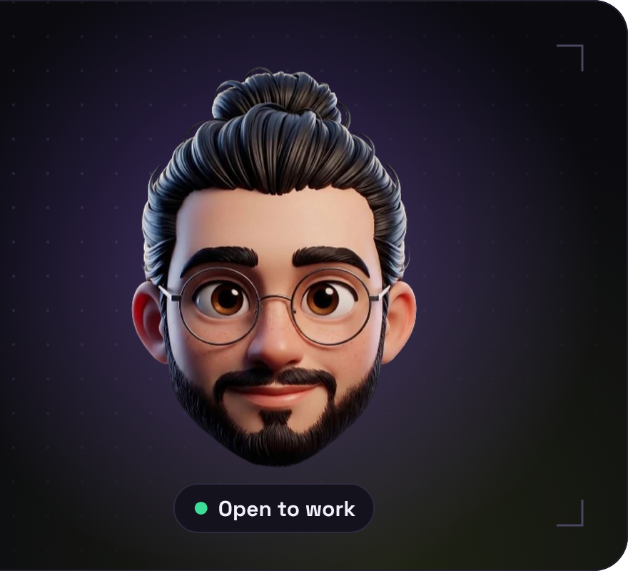

<!-- 01 · ABOUT -->

  

  

<!-- 02 · STACK -->

  

  

<!-- 03 · WORK -->

  

<a href="https://bibliotech-app.vercel.app/" target="_blank">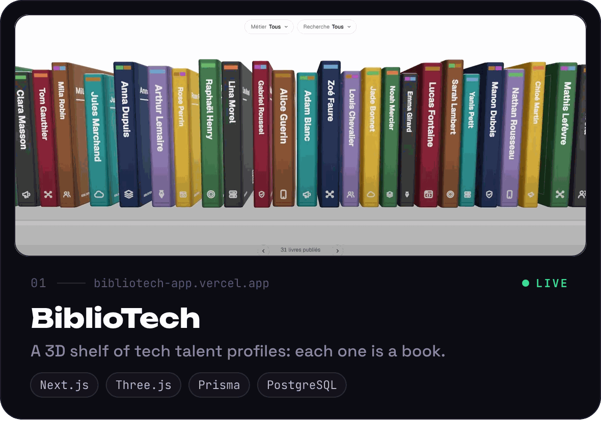</a><a href="https://gl-hf.site/" target="_blank">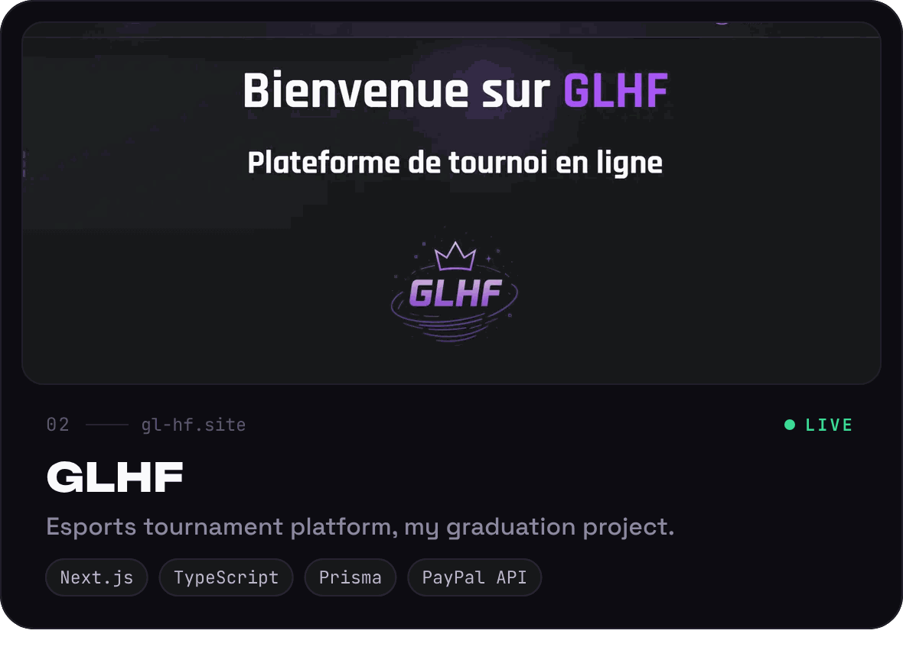</a> <a href="https://tony-cseresznyak.vercel.app/" target="_blank">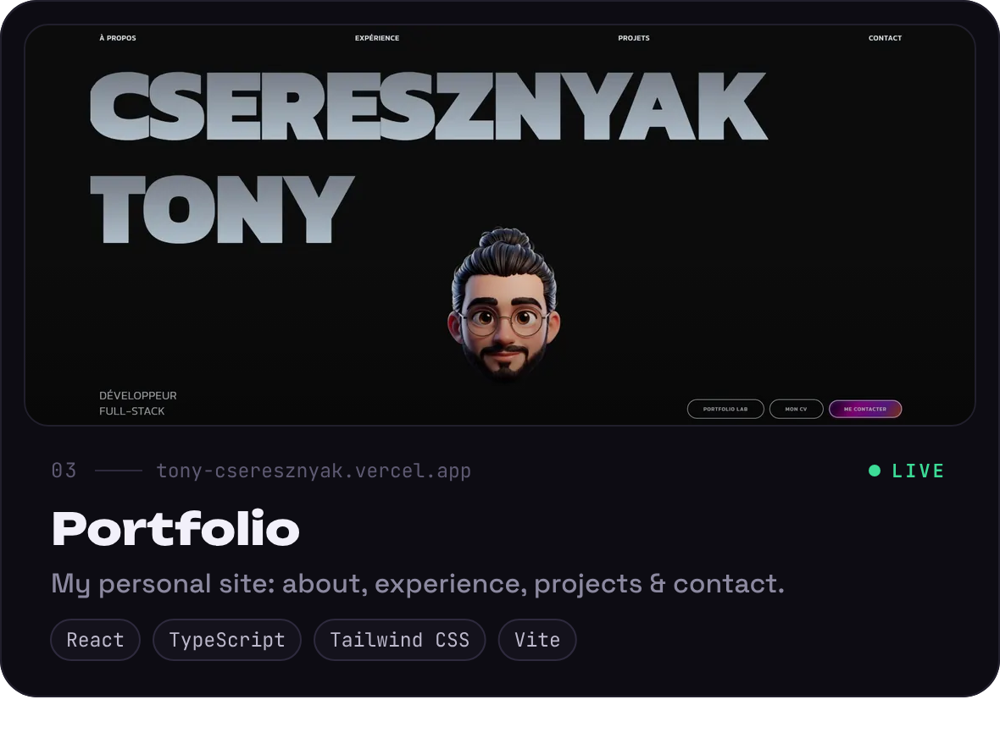</a><a href="https://pokedex-tony-cseresznyak.vercel.app/" target="_blank">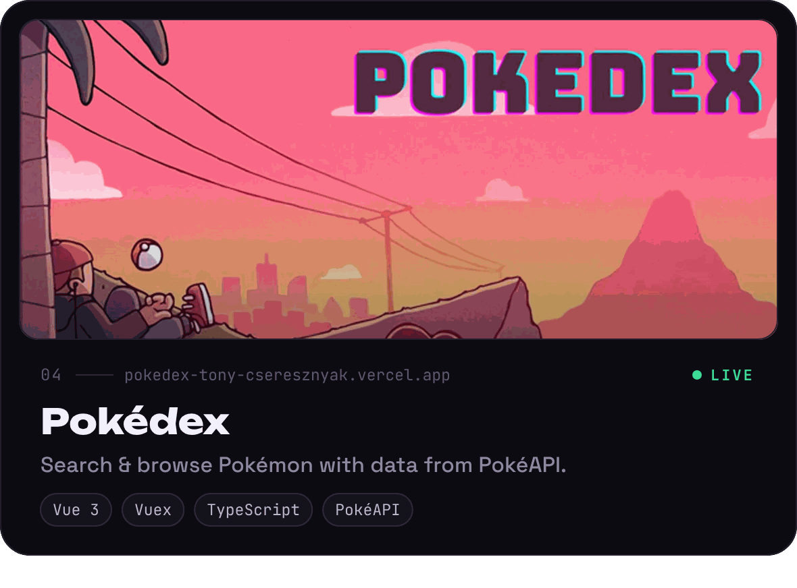</a>

<!-- 04 · STATS -->

  

<!-- 05 · CONTACT -->

  

<a href="mailto:tonycseresznyak@hotmail.com"></a><a href="https://www.linkedin.com/in/tony-cseresznyak/" target="_blank"></a><a href="https://tony-cseresznyak.vercel.app/" target="_blank"></a><a href="https://tony-cseresznyak.vercel.app/img/CSERESZNYAK_Tony_CV_Developpeur_Full_Stack.pdf" target="_blank"></a>

