<!--
  ░▒▓ TONY CSERESZNYAK — profile README ▓▒░
  Every visual below is a hand-built animated SVG (CSS keyframes + SMIL).
  Sources & generator: ./scripts/gen.py  →  edit the texts, run `python3 gen.py`, commit /assets.
-->

  

<!-- ─────────────────────────────── 01 · ABOUT ─────────────────────────────── -->

  

  

<!-- ─────────────────────────────── 02 · STACK ─────────────────────────────── -->

  

  

  

<!-- ─────────────────────────────── 03 · WORK ──────────────────────────────── -->

  

  
  

  
  

<!-- ─────────────────────────────── 04 · STATS ─────────────────────────────── -->

  

  
  

  

  <picture>
    <source media="(prefers-color-scheme: dark)" srcset="https://raw.githubusercontent.com/TonyCse/TonyCse/output/github-snake-dark.svg" />
    <source media="(prefers-color-scheme: light)" srcset="https://raw.githubusercontent.com/TonyCse/TonyCse/output/github-snake.svg" />
    
  </picture>

<!-- ────────────────────────────── 05 · CONTACT ────────────────────────────── -->

  

  
  
  

  

